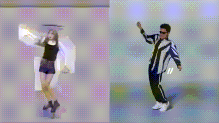
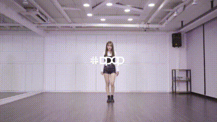

# pytorch-everybody-dance-now

> paper : Everybody Dance Now - Caroline Chan, Shiry Ginosar, Tinghui Zhou, Alexei A.Efros
>
> link : https://arxiv.org/pdf/1808.07371.pdf
>
> refer source 
>
> - pix2pixHD : https://github.com/NVIDIA/pix2pixHD
> - Pix2pix : https://github.com/junyanz/pytorch-CycleGAN-and-pix2pix

### Result

- result

- source

### Input

- source :  512x512x3 
- target : 512x512x3 

---

### Model

#### Discriminator

- multi scale discriminator (n_layer(scale) : 3, num_D : 3 )
  - Down sampling : average pooling
  - instanceNorm, spectralNorm

#### Generator

- 9 block of resnet
  - instanceNorm

#### VGG16

- for vgg loss

---

### Loss

- PathchGAN Loss
- VGG Loss
- Feature Match Loss

